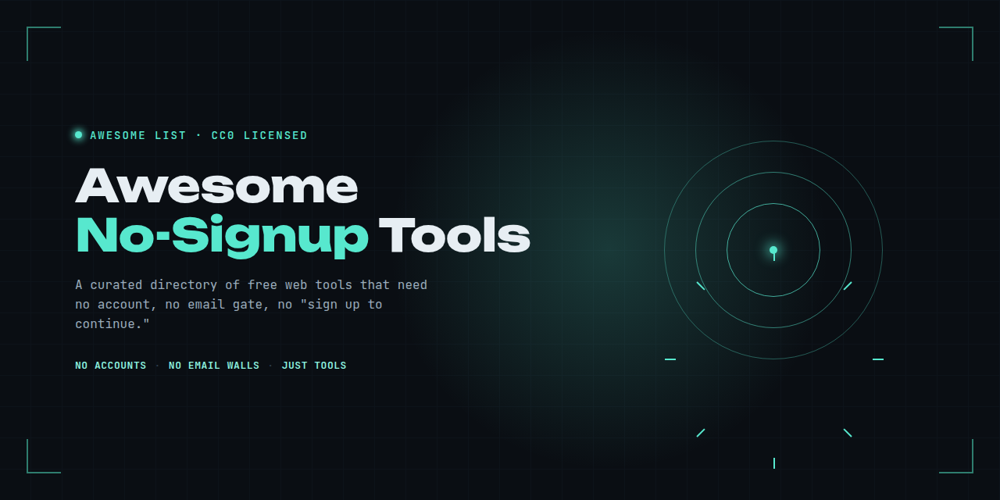

# Awesome No-Signup Tools  

> A curated list of free, online tools that work with zero signup and zero registration — many of them fully client-side. No account and no data upload required; note that some tools may still run ads or analytics.

No accounts. No email walls. No "sign up to continue". Just tools you can use right now.

Know a tool that fits? See the [contributing guidelines](contributing.md) and open a PR.

## Contents

- [Utilities](#utilities)
- [DevTools](#devtools)
- [Design](#design)
- [Productivity](#productivity)
- [Privacy](#privacy)
- [Converters](#converters)
- [Text & Writing](#text--writing)
- [Contributing](#contributing)
- [License](#license)

## Utilities

| Tool | Category | Description |
| --- | --- | --- |
| [CharCount](https://charcount.app/) | Utilities | Free character, word, and text counter with support for 11 languages, no signup, client-side processing. |
| [TinyURL](https://tinyurl.com/) | Utilities | Shortens a long URL into a short link, no signup required for a single link. |

## DevTools

| Tool | Category | Description |
| --- | --- | --- |
| [Diffchecker](https://www.diffchecker.com/) | DevTools | Compare text, files, images, or JSON side-by-side; no signup required for standard diffs. |
| [Regex101](https://regex101.com/) | DevTools | Regex tester and debugger with real-time explanation, no signup, runs matching client-side in the browser. |
| [JSFiddle](https://jsfiddle.net/) | DevTools | Online HTML/CSS/JS code editor and playground, no signup required to create and run a fiddle. |
| [JSONLint](https://jsonlint.com/) | DevTools | Validates and reformats JSON, no signup required. |

## Design

| Tool | Category | Description |
| --- | --- | --- |
| [Photopea](https://www.photopea.com/) | Design | Photoshop-like image editor that opens PSD, XD, and Sketch files directly in the browser, no signup, files processed client-side. |
| [Excalidraw](https://excalidraw.com/) | Design | Free virtual whiteboard for sketches and diagrams, no signup, open-source, runs entirely client-side. |
| [Coolors](https://coolors.co/) | Design | Color palette generator, no signup required to generate and explore palettes (saving palettes requires an account). |

## Productivity

| Tool | Category | Description |
| --- | --- | --- |
| [Pomofocus](https://pomofocus.io/) | Productivity | Customizable Pomodoro timer with task tracking, no signup required to start a session. |
| [draw.io](https://app.diagrams.net/) | Productivity | Free diagramming tool for flowcharts and diagrams, no signup, can save files locally with no server storage. |
| [World Time Buddy](https://www.worldtimebuddy.com/) | Productivity | Time zone converter and meeting planner, no signup required to use (sign-in is optional, only needed to save settings). |

## Privacy

| Tool | Category | Description |
| --- | --- | --- |
| [Bitwarden Password Generator](https://bitwarden.com/password-generator/) | Privacy | Generates strong random passwords and passphrases, no signup, processed client-side in the browser. |
| [Have I Been Pwned](https://haveibeenpwned.com/) | Privacy | Checks whether an email or password has appeared in a known data breach, no signup required for a lookup. |
| [SSL Server Test](https://www.ssllabs.com/ssltest/) | Privacy | Deep analysis of a domain's SSL/TLS configuration by Qualys, no signup required. |

## Converters

| Tool | Category | Description |
| --- | --- | --- |
| [Squoosh](https://squoosh.app/) | Converters | Image compression and format conversion tool by Google, no signup, runs entirely client-side via WebAssembly. |
| [TinyPNG](https://tinypng.com/) | Converters | Compresses PNG, JPEG, and WebP images, no signup required (free tier: up to 20 images per batch, 5MB each). |
| [CloudConvert](https://cloudconvert.com/) | Converters | Converts between 200+ document, image, audio, video, and archive formats, no signup required (free tier: 25 conversion minutes per day). |

## Text & Writing

| Tool | Category | Description |
| --- | --- | --- |
| [Hemingway Editor](https://hemingwayapp.com/) | Text & Writing | Highlights hard-to-read sentences and suggests simpler alternatives, no signup, the web editor runs client-side. |
| [LanguageTool](https://languagetool.org/) | Text & Writing | Grammar, spelling, and style checker supporting 30+ languages, no signup required for the free version. |

## Contributing

See [contributing.md](contributing.md) for guidelines on how to add a tool. Tools that don't meet our criteria are tracked in [no-go-list.md](no-go-list.md).

## License

To the extent possible under law, the contributors have waived all copyright and related rights to this work. See [LICENSE](LICENSE) for details.
